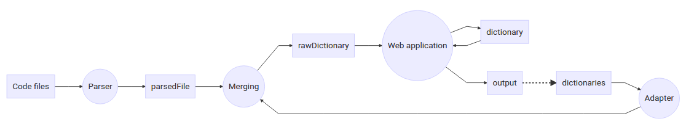

# i18n JS parser

A tool to manage translation in your code. It looks for strings that must be translated and help you to find which strings are still not translated or are become useless.

A web interface helps you to manage all strings.

You can configure your dictionary format as well from input and output.

Results are dictionary files which can be loaded by your i18n library (like https://github.com/restimel/i18n-js-formatter).

## Goal

i18n-js-parser's mission is to ease the management of keeping i18n dictionary files up-to-date (with latest strings, without old useless sentences and keep them all translated).

## Version 1.0.0

Current version supports

* code parsing to create a dictionary
* dictionaries parsing to helps for strings translation
* output templating for creating dictionaries in format you want

*If you want you can help me to improve it. Fork the project and pull request your change.*

## Use cases

* Look for all non translated sentences → Use filter "Partial" or "Not translated" for strings which have no translations at all.

* Delete useless sentences → Use filter "Useless" and then delete all display senetcnes

* Translate sentences which have changed → Look for your new sentence (Filter "New" or Filter "Not translated") and then translate it (you have the old text in similar text section at the right). You can also use the auto-filler to add the first similar sentence and then you can do the small change needed.

## Technology

Back-end
* Node JS

Front-end
* Backbone
* Bootstrap
* [i18n-js-formatter](https://github.com/restimel/i18n-js-formatter)

Backbone and Bootstrap are used from CDN, you can change links (in pages/index.html) if you want to run the application locally.

## Installation

Clone the project from github. You can install it in your project or aside it and set a configuration file in your project to define which files to parse.

## Start

Go to the root folder of the project and run:

    node main.js

Then in your browser enter the given URL (by default it is htttp://localhost:8000/index.html).


If you want to use a configuration file located elsewhere add its location as argument. For example, to parse the i18n-js-parser web part, you can use:

	node main.js pages/configuration.json

## Configuration

You can create a configuration.json file at the root of the application to run it with a different configuration.

This is a json file with the following attributes. All attributes are optional, default values will then be used.

* path: This is an object containg all references to path files.
	* parser: This refers to files to parse to extract key string and to fill dictionary.
		* files: List of path to parse. It is possible to use "*" as wildcard.

			```javascript
			{"path": {"parser": {
				"files": ["pages/index.html", "./script/*.js"]
			}}}
			```

		* except: List of path to not parse. It is possible to use "*" as wildcard.

			```javascript
			{"path": {"parser": {
				"except": ["README.md", "./documentation/*"]
			}}}
			```

    * dictionaries: This refers to existing dictionary. These files will be read as input.
        * lng: It stores path of dictionaries containing only one language. The attribute name must be the language key.
        example:

            ```javascript
            {"path": {"dictionaries": {
                "lng": {
                    "en": "./ressources/dictionary_en.json"
                }
            }}}
            ```

        Default values is an empty object.

        * globals: list of path for files containing all languages.
        (note: the parsedFile (see below) is automatically added if it exists)
        example:

            ```javascript
            {"path": {"dictionaries": {
                "globals": [
                    "./ressources/dictionary.json"
                ]
            }}}
            ```

        Default value is an empty array.

    * parsedFile: refers to where the file which have parsed all code files and conatins all strings extracted must written. This file is a inner-file which is read by adapter.
    example:

        ```javascript
        {"path": {
            "parsedFile": "./ressources/parsed.json"
        }}
        ```

    Default value is "./ressources/parsed.json".

    * rawDictionary: refers to where the file which must be sent to the front-end is created and stored.
    example:

        ```javascript
        {"path": {
            "rawDictionary": "./ressources/rawDictionary.json"
        }}
        ```

    Default value is "./ressources/rawDictionary.json".

    * dictionary: refers to where the file which contains old keys and which is sent to the front-end is created and stored.
    example:

        ```javascript
        {"path": {
            "dictionary": "./ressources/dictionary.json"
        }}
        ```

    Default value is "./ressources/dictionary.json".

    * log: refers to where the log file would be written. If it is empty no logs are written.
    Logs are many info about parsing and transforming files (adpater) matchers.
    Logs are reset every time the tool is restarted.
    example:

        ```javascript
        {"path": {
            "log": "./ressources/i18n_parser.log"
        }}
        ```

    Default value is "" (no logs).

* project: This object contains all configurations related to the project itself
    * lng: The list of languages which are supported by the project (dictionarry will be built according to this value).
    By default, its value is `['en', 'fr']`

* parser: This object contains all configurations related to parser (its goal is to extract strings which must be translated)
	* keys: list of all names used to call the translation function.
	By default, its value is `['i18n']`

* adapter: This is a list of objects which contain all configuration related to adapter (its goal is to interprete the dictionary input).
    * name: an identifier for this adapter rule
    * rules: This is an object containing all rules to read the dictionary files
        * newItem: The separator between 2 items
        * getKey: The rule to retrieve the sentence key
        * getContext: the rule to retrieve the sentence context
        * getLabels: delimit the part where labels are defined
        * getLabel: Retrieve the translation of the syntax. If the RegExp is Global (flag g) it retrieve also the key language
        * getFiles: delimit the part where files associated to this sentence ar defined
        * getFile: retrieve the files associated to this sentence (it should have flag g).
        * cleanResult: this rule is to clean results for example to get a simple " from \". This rule is a double array. The first value of each item is the string to replace (please note that it is parsed in a RegExp), and the second is the replacement to do. E.g. [["\\\\\"", "\""]] (because the final RegExp will be /\\"/).

* replacements: This object contains all rules for replacements. A rule is an object containing 3 attributes:
    * pattern: the pattern to look for (a regular expression)
    * flags: the flags to apply on the RegExp
    * substr: A string which replace the pattern

* templates: It contains all templates to define the ouput format. Each attribute can be use as a template replacement.
Templates format are:
    * @@    display a @
    * @tag@ refers to another tag template
    * @TAG@ refers to predefined tag:
        * ITEM: the dictionary item
        * KEY: the key of the item
        * CONTEXT: the context of the item
        * LNG: the language of the sentence (must be used in a LABELS context)
        * LABEL: the translation of the sentence (must be used in a LABELS context)
        * FILE: the path of the file (must be used in a FILES context)
    * @tag[CMD]@ iterate the tag with the CMD as context. Possible CMD:
        * ITEMS: the list of items
        * LABELS: the list of labels sentences
        * FILES: the list of files
    * @tag[CMD](value)@ join the results with 'value' instead of empty string
    *
    * @obj.prop@ get the property 'prop' from the objet 'obj'. obj can be either a tag either a cmd
    * @tag{CMD}@ display the tag only if CMD is truthy
    * @tag~replacement@ display the tag and apply the replacement on it. The replacement refers to an attribute defined in "replacements"
example:

	```javascript
    {
        templates: {
            item: '{\"key\":\"@KEY@\"@context{CONTEXT}@,\"labels\":{@label[LABELS](,)@},\"files\":[@file[FILES](,)@]}',
            context: ',\"context\":\"@CONTEXT@\"',
            label: '\"@LNG@\":\"@LABEL@\"',
            file: '\"@FILE@\"'
        }
    }
    ```

* output: list of output files. It describes which files must be output and how. The tag `@tag@` are defined in templates (cf above).
example:

```javascript
{
    output: [{
        path: './ressources/dictionary.json',
        format: '[@item[ITEMS](,)@]'
    }]
}
```

## Workflow

Here is how this tool works.


*parsedFile* is built from source code.

*Adapter* will read your existing *dictionnaries* files and merge it with the parsedFile to build the *rawDictionary*.

The web application (which you must run locally) reads the *dictionary* file (which is an inner file to compare modifications) and the rawDictionary. All difference from these files are considered as new changes (either new entries, updates or deprecated keys).

When saving from web application, the dictionary is updated and *output* files are generated. These output files should be your dictionaries files handled by Adapter to have a full life cycle.

**dictionaries** file(s) should be the one used in your project.
